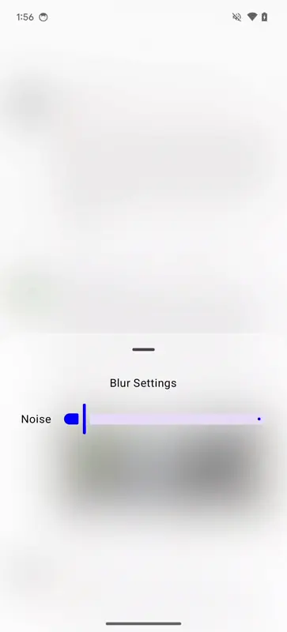
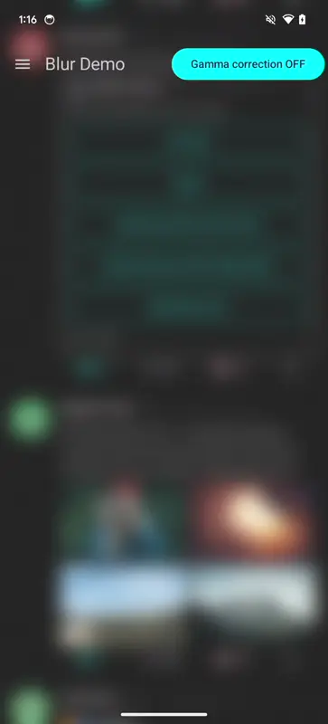
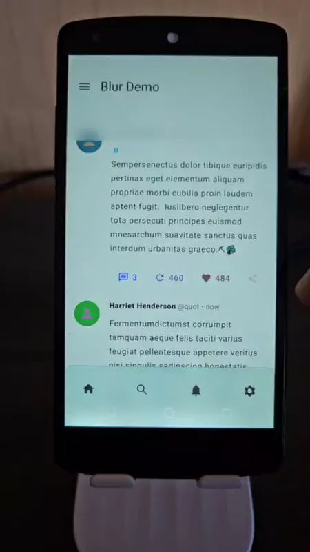

# Imla - (Experimental) GPU-Accelerated Blurring for Android Jetpack Compose UI

> ⚠️ **Disclaimer**:
> This project is experimental and not intended for use in production applications.

## Description

Imla (Ukrainian for "Haze", pronounced [ˈimlɑ] (eem-lah)) is an experimental project exploring
GPU-accelerated view blurring on Android. It aims to implement efficient blurring effects using
OpenGL, targeting devices from Android 6 (API 23) onwards.

The project serves as a playground for experimenting with GPU rendering and post-processing effects,
with the potential to evolve into a full-fledged library in the future.

## Features

- Gamma corrected blurring;
- Adjustable blur radius;
- Color tinting of blurred areas;
- Blending with a noise mask for a frosted glass effect;
- Setting blurring masks for gradient blur effects;
- Supports Android 6 (API 23) onwards.

## Demo

<table>
    <thead>
        <tr>
            <th colspan=2><b>Pixel 6</b></th>
        </tr>
    </thead>
    <tbody>
        <tr>
            <td></td>
            <td></td>
        </tr>
        <tr>
            <td></td>
            <td></td>
        </tr>
        <tr>
            <td></td>
            <td></td>
        </tr>
    </tbody>
</table>

| **Nexus 5**                                                                                                                                      |
|--------------------------------------------------------------------------------------------------------------------------------------------------|
|                                                                                |
|  |
|                         |

## How It Works

Imla uses a combination of `GraphicsLayer` from Jetpack Compose and OpenGL ES 3.0 to achieve fast,
GPU-accelerated blurring. The processing pipeline does multiple steps to achieve blurred effect:

1. A specified view is rendered as a background texture using `Surface` and `SurfaceTexture`(
   see [RenderableRootLayer.kt](imla/src/main/java/dev/serhiiyaremych/imla/uirenderer/RenderableRootLayer.kt)).
2. The rendered texture is copied to a post-processing framebuffer.
3. The [BackdropBlur](imla/src/main/java/dev/serhiiyaremych/imla/ui/BackdropBlur.kt) composable
   wraps
   child composable elements that need a blurred background.
4. The blurred texture is rendered as a SurfaceView background to the wrapped elements, creating the
   illusion of a blurred backdrop.

The post-processing pipeline includes:

1. Down-sampling the background
   texture, [RenderableRootLayer.kt](imla/src/main/java/dev/serhiiyaremych/imla/uirenderer/RenderableRootLayer.kt);
2. Applying a two-pass blur algorithm with gamma
   correction, [BlurEffect](imla/src/main/java/dev/serhiiyaremych/imla/uirenderer/postprocessing/blur/BlurEffect.kt);
3. Blending with a noise texture for a frosted glass
   effect, [NoiseEffect](imla/src/main/java/dev/serhiiyaremych/imla/uirenderer/postprocessing/noise/NoiseEffect.kt);
4. (Optional) Application of a mask for progressive or gradient blur
   effects, [MaskEffect](imla/src/main/java/dev/serhiiyaremych/imla/uirenderer/postprocessing/mask/MaskEffect.kt).

Importantly, all blur color processing is performed in the linear color space, with appropriate
gamma decoding and encoding applied to ensure colors blend naturally, preserving vibrancy and
contrast.

## Rendering Abstraction

The project reuses the OpenGL abstractions from another experimental
project: [desugar-64/android-opengl-renderer](https://github.com/desugar-64/android-opengl-renderer).
This repo is a playground to learn graphics and OpenGL, including some convenient abstractions
for setting up OpenGL data structures and calling various OpenGL functions.

The current implementation uses a fully dynamic renderer, which pushes vertex data each frame. While
this approach offers flexibility, it introduces some performance overhead. Future iterations aim to
optimize this aspect of the rendering pipeline.

## Performance

Current performance metrics for the blur effect on a Pixel 6 device:

- `BlurEffect#applyEffect`: ~1.19ms
- `RenderObject#onRender` : ~4.842ms

| Trace                                                                                                  |
|--------------------------------------------------------------------------------------------------------|
|   |
|  |
|  |

These timings indicate that the blur effect and rendering process are relatively fast, but there's
still room for optimization.

## Future Plans

[ ] Implement Dual Kawase Blurring Filter for improved performance;
[ ] Optimize the rendering pipeline and OpenGL abstractions;
[ ] Address synchronization issues between the main thread and OpenGL thread.

## Contributing

This project is open to suggestions and contributions. Feel free to open issues
or submit pull requests on GitHub.

## License

This project is licensed under the MIT License. See the [LICENSE](LICENSE) file for details.

## Development Updates

For project development updates and history, refer
to [this Twitter thread](https://x.com/desugar_64/status/1787633739117277669).
