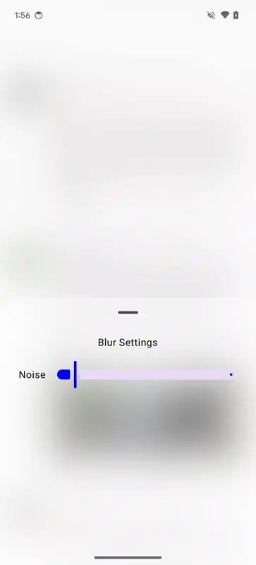
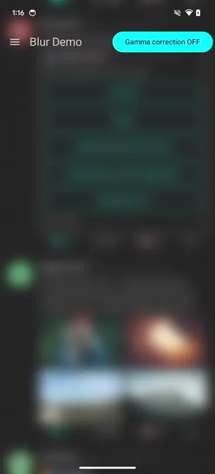
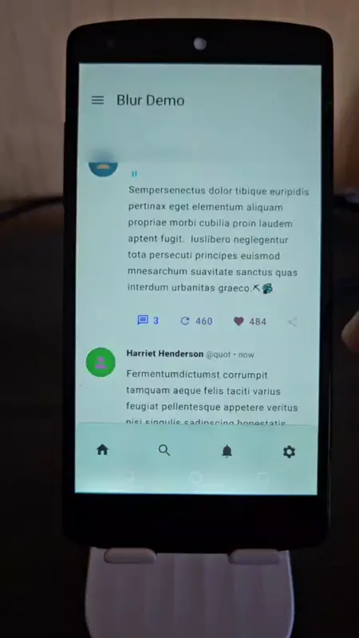
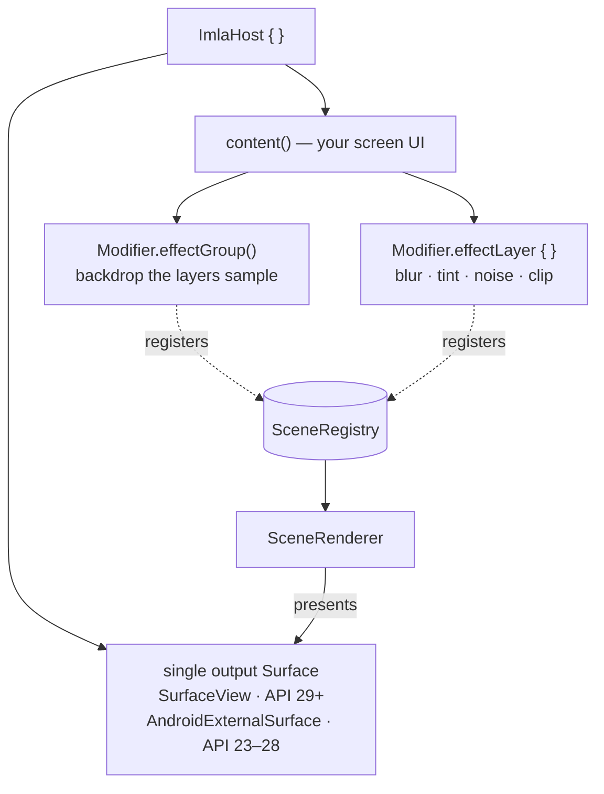
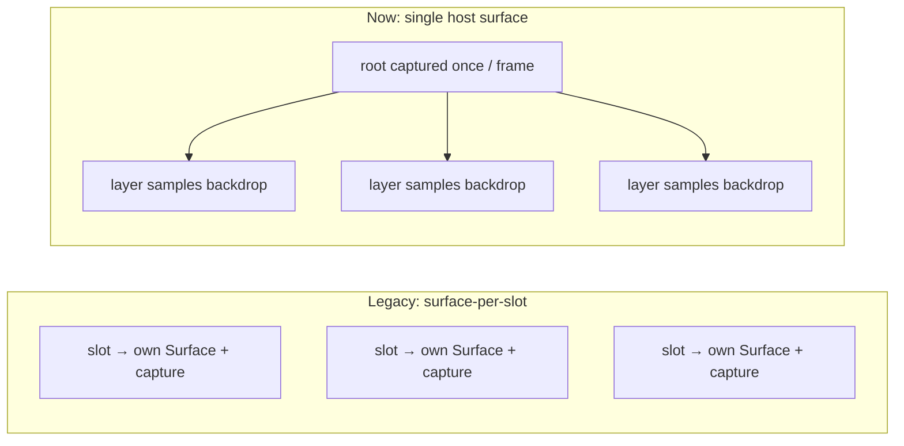
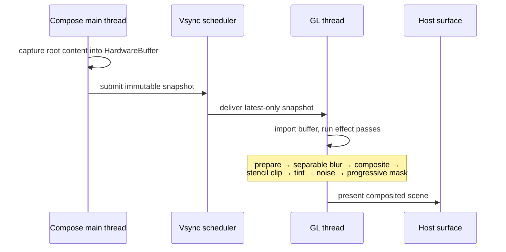

# Imla - (Experimental) GPU-Accelerated Blurring for Android Jetpack Compose UI

> [!CAUTION]
> **This is not a library, and it is not production-ready.** Imla is a for-fun
> experiment exploring an alternative Jetpack Compose rendering approach — capturing
> the Compose root and effect layers through OpenGL and HardwareBuffers. Don't ship it.

## Description

Imla (Ukrainian for "Haze", pronounced [ˈimlɑ] (eem-lah)) is an experimental project exploring
GPU-accelerated view blurring on Android. It aims to implement efficient blurring effects using
OpenGL, targeting devices from Android 6 (API 23) onwards.

The project serves as a playground for experimenting with GPU rendering and post-processing effects,
with the potential to evolve into a full-fledged library in the future.

## Features

- Gamma corrected blurring;
- Adjustable blur radius;
- Color tinting of blurred areas;
- Blending with a noise mask for a frosted glass effect;
- Setting blurring masks for gradient blur effects;
- Supports Android 6 (API 23) onwards.

## Showcase

Each tile below is a single `Modifier.effectLayer { … }` sampling one shared
backdrop — rendered on a calibration grid so the effect is easy to read.

<p align="center">
  
</p>

<table>
  <tr>
    <td align="center" width="33%"><br/><b>Blur</b><br/><code>backdropBlur(radius)</code></td>
    <td align="center" width="33%"><br/><b>Tint</b><br/><code>tint(color)</code></td>
    <td align="center" width="33%"><br/><b>Frosted noise</b><br/><code>noise(alpha)</code></td>
  </tr>
  <tr>
    <td align="center"><br/><b>Progressive blur</b><br/>crisp top → blurred bottom<br/><code>backdropBlur(radius, progressiveMask)</code></td>
    <td align="center"><br/><b>Shape mask</b><br/>arbitrary clip outline<br/><code>clip(shape)</code></td>
    <td align="center"><br/><b>Rotation</b><br/>3-axis tilt stays aligned<br/><code>graphicsLayer { rotationX/Y/Z }</code></td>
  </tr>
  <tr>
    <td align="center" colspan="3"><br/><b>Composite</b><br/>stack independent blur layers — each effect samples the shared backdrop and composites by z-order</td>
  </tr>
</table>

## Demo

<table>
    <thead>
        <tr>
            <th colspan=2><b>Pixel 6</b></th>
        </tr>
    </thead>
    <tbody>
        <tr>
            <td></td>
            <td></td>
        </tr>
        <tr>
            <td></td>
            <td></td>
        </tr>
        <tr>
            <td></td>
            <td></td>
        </tr>
    </tbody>
</table>


| **Nexus 5**                                                                                                                                      |
|--------------------------------------------------------------------------------------------------------------------------------------------------|
|                                                                                |
|  |
|                         |

## Usage

Wrap a screen — or any region — in `ImlaHost`, then declare blur regions with the
`effectGroup` / `effectLayer` modifiers. No renderer or OpenGL objects are passed
to children; they register through the host.

```kotlin
ImlaHost {
    Box(
        modifier = Modifier
            .fillMaxSize()
            .effectGroup() // the backdrop that effect layers sample from
    ) {
        FeedContent()

        TopBar(
            modifier = Modifier.effectLayer {
                backdropBlur(radius = 12.dp)
                tint(Color.White.copy(alpha = 0.1f))
                noise(alpha = 0.15f)
                clip(RoundedCornerShape(16.dp))
            }
        )
    }
}
```

Public API: `ImlaHost`, `Modifier.effectGroup()`, `Modifier.effectLayer { ... }`,
`EffectLayerScope`, and `EffectLayerBoundsProvider`.

## Architecture

`ImlaHost` wraps everything inside it into a **single** GPU-backed surface and
renders all content and effects through it. Children never touch the renderer —
they register through the host's `SceneRegistry`.


```mermaid
flowchart TB
    Host["ImlaHost { }"]
    Content["content() — your screen UI"]
    Group["Modifier.effectGroup()<br/>backdrop the layers sample"]
    Layer["Modifier.effectLayer { }<br/>blur · tint · noise · clip"]
    Registry[("SceneRegistry")]
    Renderer["SceneRenderer"]
    Surface["single output Surface<br/>SurfaceView · API 29+<br/>AndroidExternalSurface · API 23–28"]

    Host --> Content
    Host --> Surface
    Content --> Group
    Content --> Layer
    Group -. registers .-> Registry
    Layer -. registers .-> Registry
    Registry --> Renderer
    Renderer -- presents --> Surface
```

Output surface:

- **API 29+** — a `SurfaceView` presented via `SurfaceControl`; the renderer hands
  `HardwareBuffer`s straight to SurfaceFlinger (zero-copy).
- **API 23–28** — a Compose `AndroidExternalSurface` the renderer blits into.

This replaces the earlier **surface-per-slot** design: the root content is now
captured **once per frame** and shared by every effect layer, instead of one
surface and one capture per blurred region.


```mermaid
flowchart LR
    subgraph legacy["Legacy: surface-per-slot"]
        direction TB
        LS1["slot → own Surface + capture"]
        LS2["slot → own Surface + capture"]
        LS3["slot → own Surface + capture"]
    end
    subgraph now["Now: single host surface"]
        direction TB
        Root["root captured once / frame"]
        Root --> N1["layer samples backdrop"]
        Root --> N2["layer samples backdrop"]
        Root --> N3["layer samples backdrop"]
    end
```

### Per-frame flow


```mermaid
sequenceDiagram
    participant UI as Compose main thread
    participant VS as Vsync scheduler
    participant GL as GL thread
    participant SF as Host surface
    UI->>UI: capture root content into HardwareBuffer
    UI->>VS: submit immutable snapshot
    VS->>GL: deliver latest-only snapshot
    GL->>GL: import buffer, run effect passes
    Note over GL: prepare → separable blur → composite →<br/>stencil clip → tint → noise → progressive mask
    GL->>SF: present composited scene
```

### HardwareBuffers end-to-end

The Compose root is drawn into a `HardwareBuffer` (a `RenderNode` rendered single-buffered off
the main thread) rather than giving every blurred region its own `Surface`; the effect layers then
all sample that one shared backdrop.

Each captured buffer is handed to the GL thread and imported **zero-copy** as a texture via
`eglCreateImageFromHardwareBuffer` + `glEGLImageTargetTexture2DOES`, so the blur passes sample it
directly with no `glReadPixels` round-trip back to the CPU.

Combined with the API 29+ present path that hands finished `HardwareBuffer`s straight to
SurfaceFlinger, pixels stay in GPU/shared memory across capture → effects → present. This whole
HardwareBuffer path is the main thing being experimented with here, and is still being tuned.

See [doc/scene2-scratch-renderer-status.md](doc/scene2-scratch-renderer-status.md)
for current status, implemented pieces, non-goals, and next steps.

## Rendering Abstraction

The project reuses the OpenGL abstractions from another experimental
project: [desugar-64/android-opengl-renderer](https://github.com/desugar-64/android-opengl-renderer).
This repo is a playground to learn graphics and OpenGL, including some convenient abstractions
for setting up OpenGL data structures and calling various OpenGL functions.

The current implementation uses a fully dynamic renderer, which pushes vertex data each frame. While
this approach offers flexibility, it introduces some performance overhead. Future iterations aim to
optimize this aspect of the rendering pipeline.

## Performance

Notes on the blur effect on a Pixel 6 device:

- The separable Gaussian blur pass is the dominant GPU cost; it scales with the
  blur radius and the on-screen area being blurred.
- Per-frame cost is driven mostly by render-pass / FBO switches rather than the
  blur math itself, so timing varies by demo scene.

| Trace                                                                                                  |
|--------------------------------------------------------------------------------------------------------|
|   |
|  |
|  |

These timings indicate that the blur effect and rendering process are relatively fast, but there's
still room for optimization.

## Roadmap

- [x] Render the Compose root through OpenGL behind a single host surface;
- [x] Capture and draw child content as GL textures;
- [x] Validate rotated slot geometry and root-space backdrop sampling;
- [x] Real separable Gaussian blur passes;
- [x] Progressive masks, stencil clips, tint, noise, and cumulative backdrop sampling;
- [ ] Automatic cumulative dependency optimization and metrics.

## Contributing

This project is open to suggestions and contributions. Feel free to open issues
or submit pull requests on GitHub.

## License

This project is licensed under the MIT License. See the [LICENSE](LICENSE) file for details.

## Development Updates

For project development updates and history, refer
to [this Twitter thread](https://x.com/desugar_64/status/1787633739117277669).
