# Imla - (Experimental) GPU-Accelerated Blurring for Android Jetpack Compose UI

> [!CAUTION]
> **This is not a library, and it is not production-ready.** Imla is a for-fun
> experiment exploring an alternative Jetpack Compose rendering approach — capturing
> the Compose root and effect layers through OpenGL and HardwareBuffers. Don't ship it.

## Description

Imla (Ukrainian for "Haze", pronounced [ˈimlɑ] (eem-lah)) is an experimental
GPU-accelerated backdrop blur for Jetpack Compose. It captures the Compose root
into a `HardwareBuffer`, imports it zero-copy as an OpenGL ES texture, and runs
blur, tint, noise, clip, and progressive-mask passes that sample that shared
backdrop. Targets Android 6 (API 23) and up.

## Features

- Gamma corrected blurring;
- Adjustable blur radius;
- Color tinting of blurred areas;
- Blending with a noise mask for a frosted glass effect;
- Setting blurring masks for gradient blur effects;
- Supports Android 6 (API 23) onwards.

## Showcase

Each tile below is a single `Modifier.effectLayer { … }` sampling one shared
backdrop — rendered on a calibration grid so the effect is easy to read.

<p align="center">
  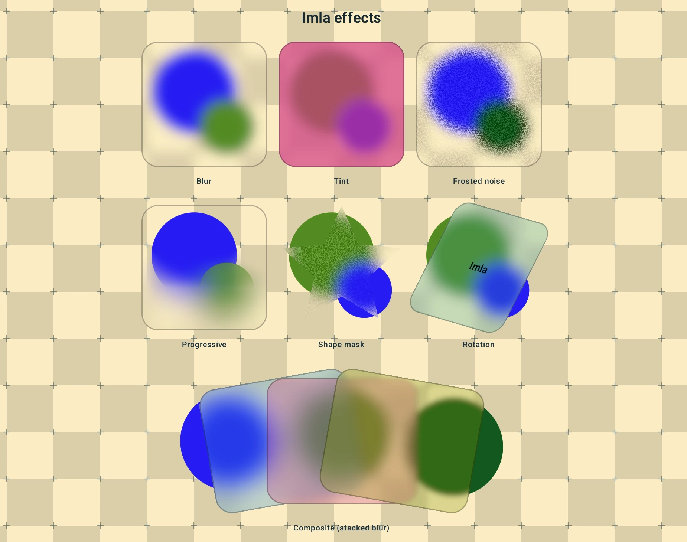
</p>

<table>
  <tr>
    <td align="center" width="33%">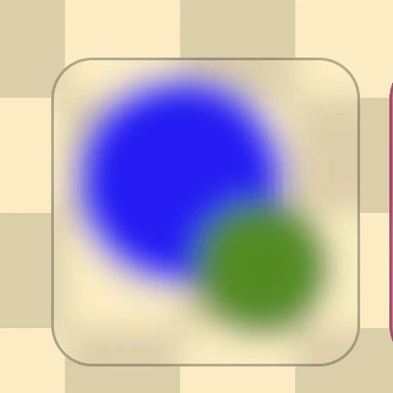<br/><b>Blur</b><br/><code>backdropBlur(radius)</code></td>
    <td align="center" width="33%">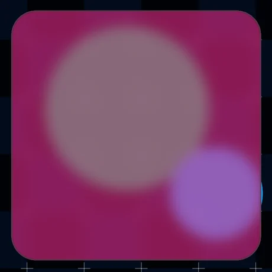<br/><b>Tint</b><br/><code>tint(color)</code></td>
    <td align="center" width="33%">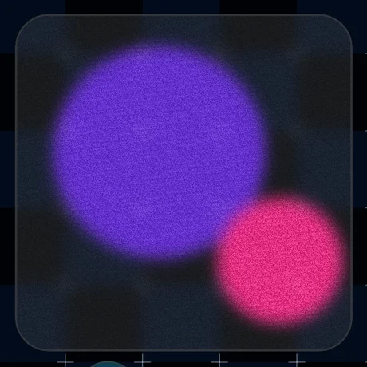<br/><b>Frosted noise</b><br/><code>noise(alpha)</code></td>
  </tr>
  <tr>
    <td align="center">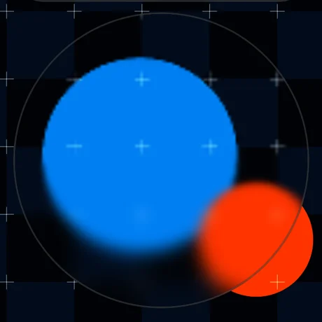<br/><b>Progressive blur</b><br/>crisp top → blurred bottom<br/><code>backdropBlur(radius, progressiveMask)</code></td>
    <td align="center">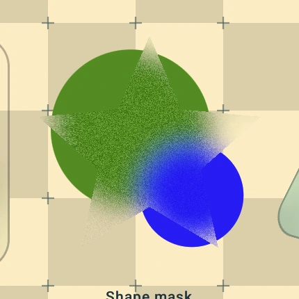<br/><b>Shape mask</b><br/>arbitrary clip outline<br/><code>clip(shape)</code></td>
    <td align="center">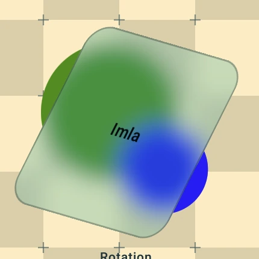<br/><b>Rotation</b><br/>3-axis tilt stays aligned<br/><code>graphicsLayer { rotationX/Y/Z }</code></td>
  </tr>
  <tr>
    <td align="center" colspan="3">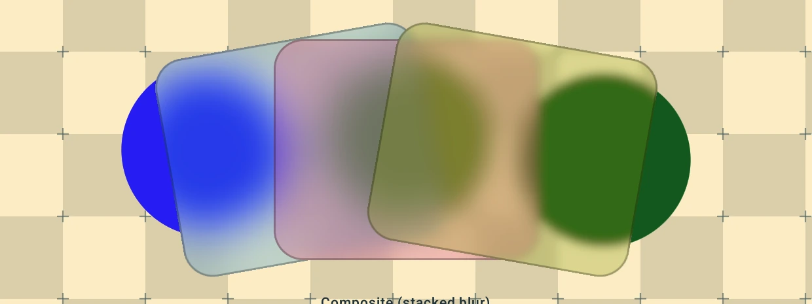<br/><b>Composite</b><br/>stack independent blur layers — each effect samples the shared backdrop and composites by z-order</td>
  </tr>
</table>

## Usage

Wrap a screen — or any region — in `ImlaHost`, then declare blur regions with the
`effectGroup` / `effectLayer` modifiers. No renderer or OpenGL objects are passed
to children; they register through the host.

```kotlin
ImlaHost {
    Box(
        modifier = Modifier
            .fillMaxSize()
            .effectGroup() // the backdrop that effect layers sample from
    ) {
        FeedContent()

        TopBar(
            modifier = Modifier.effectLayer {
                backdropBlur(radius = 12.dp)
                tint(Color.White.copy(alpha = 0.1f))
                noise(alpha = 0.15f)
                clip(RoundedCornerShape(16.dp))
            }
        )
    }
}
```

Public API:
[`ImlaHost`](imla/src/main/java/dev/serhiiyaremych/imla/ImlaHost.kt#L58),
[`Modifier.effectGroup()`](imla/src/main/java/dev/serhiiyaremych/imla/EffectLayer.kt#L25),
[`Modifier.effectLayer { ... }`](imla/src/main/java/dev/serhiiyaremych/imla/EffectLayer.kt#L33),
[`EffectLayerScope`](imla/src/main/java/dev/serhiiyaremych/imla/EffectLayer.kt#L59), and
[`EffectLayerBoundsProvider`](imla/src/main/java/dev/serhiiyaremych/imla/EffectLayer.kt#L45).

## Architecture

`ImlaHost` wraps everything inside it into a **single** GPU-backed surface and
renders all content and effects through it. Children never touch the renderer —
they register through the host's `SceneRegistry`.

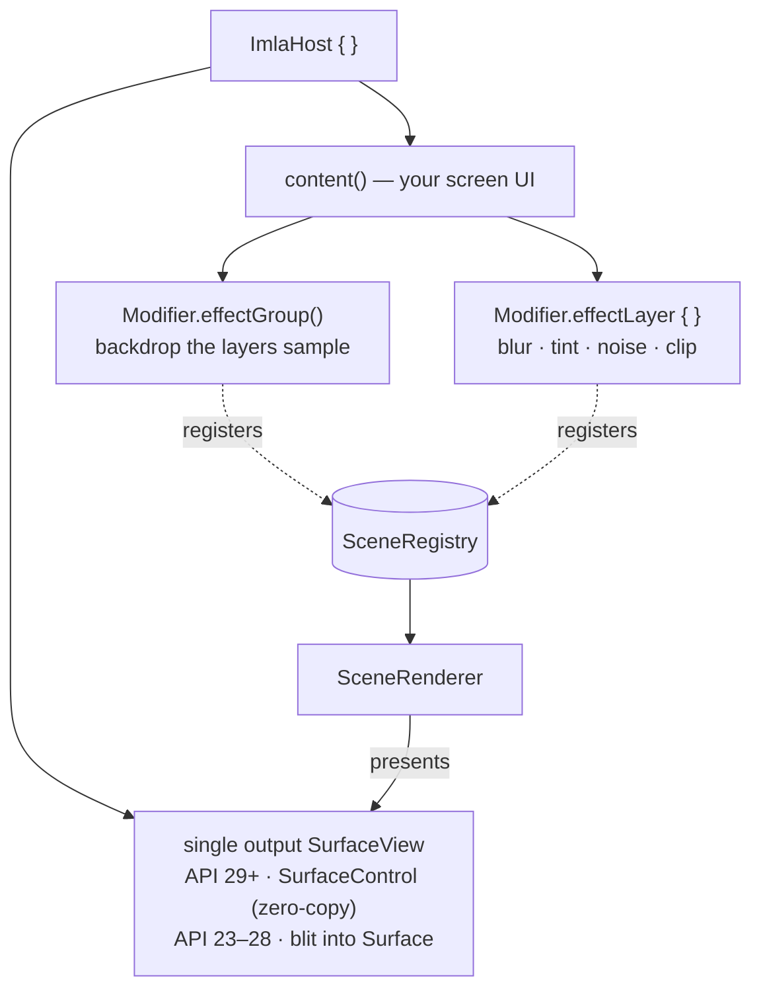
```mermaid
flowchart TB
    Host["ImlaHost { }"]
    Content["content() — your screen UI"]
    Group["Modifier.effectGroup()<br/>backdrop the layers sample"]
    Layer["Modifier.effectLayer { }<br/>blur · tint · noise · clip"]
    Registry[("SceneRegistry")]
    Renderer["SceneRenderer"]
    Surface["single output SurfaceView<br/>API 29+ · SurfaceControl (zero-copy)<br/>API 23–28 · blit into Surface"]

    Host --> Content
    Host --> Surface
    Content --> Group
    Content --> Layer
    Group -. registers .-> Registry
    Layer -. registers .-> Registry
    Registry --> Renderer
    Renderer -- presents --> Surface
```

The output is a single `SurfaceView` on all supported APIs (Compose's
`AndroidExternalSurface` is itself backed by a `SurfaceView`). What differs is how
the renderer presents into it:

- **API 29+** — the `SurfaceView` is driven via `SurfaceControl`; the renderer
  hands `HardwareBuffer`s straight to SurfaceFlinger with no present pass or
  `eglSwapBuffers` (zero-copy).
- **API 23–28** — there is no `SurfaceControl`, so the renderer blits into the
  `SurfaceView`'s `Surface` (obtained through `AndroidExternalSurface`).

This replaces the earlier **surface-per-slot** design: the root content is now
captured **once per frame** and shared by every effect layer, instead of one
surface and one capture per blurred region.

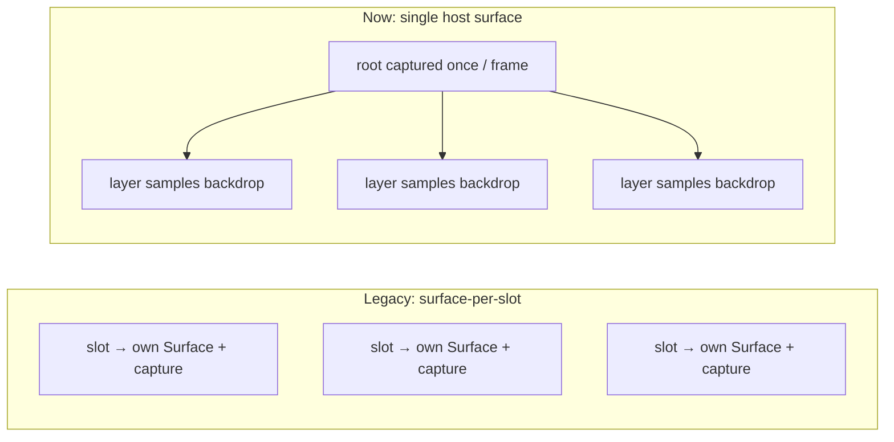
```mermaid
flowchart LR
    subgraph legacy["Legacy: surface-per-slot"]
        direction TB
        LS1["slot → own Surface + capture"]
        LS2["slot → own Surface + capture"]
        LS3["slot → own Surface + capture"]
    end
    subgraph now["Now: single host surface"]
        direction TB
        Root["root captured once / frame"]
        Root --> N1["layer samples backdrop"]
        Root --> N2["layer samples backdrop"]
        Root --> N3["layer samples backdrop"]
    end
```

### Per-frame flow

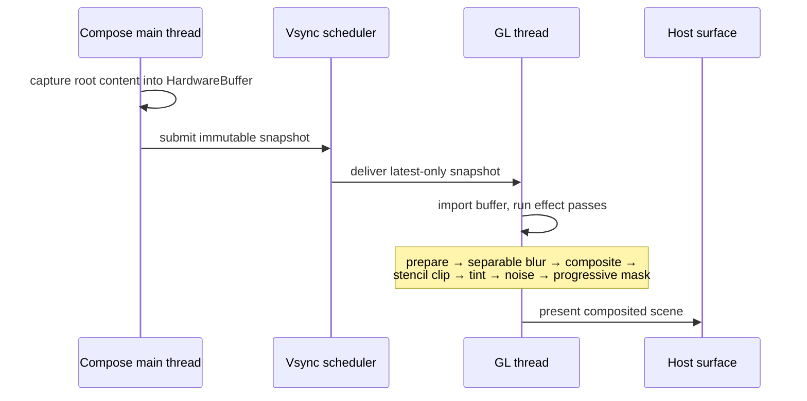
```mermaid
sequenceDiagram
    participant UI as Compose main thread
    participant VS as Vsync scheduler
    participant GL as GL thread
    participant SF as Host surface
    UI->>UI: capture root content into HardwareBuffer
    UI->>VS: submit immutable snapshot
    VS->>GL: deliver latest-only snapshot
    GL->>GL: import buffer, run effect passes
    Note over GL: prepare → separable blur → composite →<br/>stencil clip → tint → noise → progressive mask
    GL->>SF: present composited scene
```

### HardwareBuffers end-to-end

The Compose root is drawn into a `HardwareBuffer` (a `RenderNode` rendered single-buffered off
the main thread) rather than giving every blurred region its own `Surface`; the effect layers then
all sample that one shared backdrop. Capture lives in
[`SingleBufferRenderer`](imla/src/main/java/dev/serhiiyaremych/imla/internal/capture/SingleBufferRenderer.kt),
and the captured buffer is leased to the GL thread through
[`BufferLease`](imla/src/main/java/dev/serhiiyaremych/imla/internal/capture/BufferLease.kt).

Each captured buffer is handed to the GL thread and imported **zero-copy** as a texture via
`eglCreateImageFromHardwareBuffer` + `glEGLImageTargetTexture2DOES`, so the blur passes sample it
directly with no `glReadPixels` round-trip back to the CPU. The EGL import is in
[`OpenGLHardwareBufferTexture2D`](imla/src/main/java/dev/serhiiyaremych/imla/internal/render/opengl/OpenGLHardwareBufferTexture2D.kt),
driven on the GL thread by
[`CapturedFrameImporter`](imla/src/main/java/dev/serhiiyaremych/imla/internal/render/gl/CapturedFrameImporter.kt).

Combined with the API 29+ present path that hands finished `HardwareBuffer`s straight to
SurfaceFlinger (see
[`ScenePresenter`](imla/src/main/java/dev/serhiiyaremych/imla/internal/render/gl/pipeline/ScenePresenter.kt)
and the buffer ring in
[`SceneHwBufferRing`](imla/src/main/java/dev/serhiiyaremych/imla/internal/render/gl/pipeline/SceneHwBufferRing.kt)),
pixels stay in GPU/shared memory across capture → effects → present. This whole
HardwareBuffer path is the main thing being experimented with here, and is still being tuned.

## Rendering Abstraction

The project reuses the OpenGL abstractions from another experimental
project: [desugar-64/android-opengl-renderer](https://github.com/desugar-64/android-opengl-renderer).
This repo is a playground to learn graphics and OpenGL, including some convenient abstractions
for setting up OpenGL data structures and calling various OpenGL functions.

The current implementation uses a fully dynamic renderer, which pushes vertex data each frame. While
this approach offers flexibility, it introduces some performance overhead. Future iterations aim to
optimize this aspect of the rendering pipeline.

## Performance notes

- The separable Gaussian blur pass is the dominant GPU cost; it scales with the
  blur radius and the on-screen area being blurred.
- Per-frame cost is driven mostly by render-pass / FBO switches rather than the
  blur math itself, so timing varies by scene.

## Known issues and limitations

- **HardwareBuffer capture is not always the fastest path.** Across the 4 devices
  I tested on, the hardware-rendering capture path (`RenderNode` →
  `HardwareBuffer` → zero-copy GL import) is fast on 3. On the 4th, a low-end
  budget Android 13 tablet, it runs slower than capturing the UI into an external
  texture. The cause is not yet pinned down.
- **No atlas grouping yet.** Effect layers are rendered with separate
  draws/passes instead of being batched into a shared texture atlas. Atlas
  grouping is the main remaining GL-side optimization, but it is not implemented
  because of the complexity of integrating it with the bucketed capture buffers
  used for resizable content.
- **Dynamic per-frame vertex push.** The renderer uploads vertex data every
  frame (see [Rendering Abstraction](#rendering-abstraction)). Flexible, but it
  adds per-frame overhead that a static/instanced path would avoid.
- **Convoluted internal architecture.** The code grew through iteration and is
  more tangled than it needs to be: capture/import/present responsibilities are
  spread across many small types, and some seams exist only for past experiments.
  It works, but expect rough edges when reading or extending it.

## Roadmap

- [x] Render the Compose root through OpenGL behind a single host surface;
- [x] Capture and draw child content as GL textures;
- [x] Validate rotated slot geometry and root-space backdrop sampling;
- [x] Real separable Gaussian blur passes;
- [x] Progressive masks, stencil clips, tint, noise, and cumulative backdrop sampling;
- [ ] Automatic cumulative dependency optimization and metrics.
- [ ] Atlas grouping for effect layers (needs integration with the bucketed
  capture buffers).

### To explore

- **Present directly into the Compose layout, no SurfaceView.** Instead of the
  dedicated `SurfaceView`/`SurfaceControl` present path, wrap the composited
  effect result `HardwareBuffer` as a hardware `Bitmap` (`Bitmap.wrapHardwareBuffer`,
  API 29+) and draw it straight in the Compose layout. This keeps the whole
  pipeline on-GPU (no `glReadPixels` round-trip) and could also drop the separate
  capture/present surface. Open question: how fast this path actually is versus
  the current SurfaceView present, especially on lower-end devices.

## Contributing

This project is open to suggestions and contributions. Feel free to open issues
or submit pull requests on GitHub.

## License

This project is licensed under the MIT License. See the [LICENSE](LICENSE) file for details.

## Development Updates

For project development updates and history, refer
to [this Twitter thread](https://x.com/desugar_64/status/1787633739117277669).
